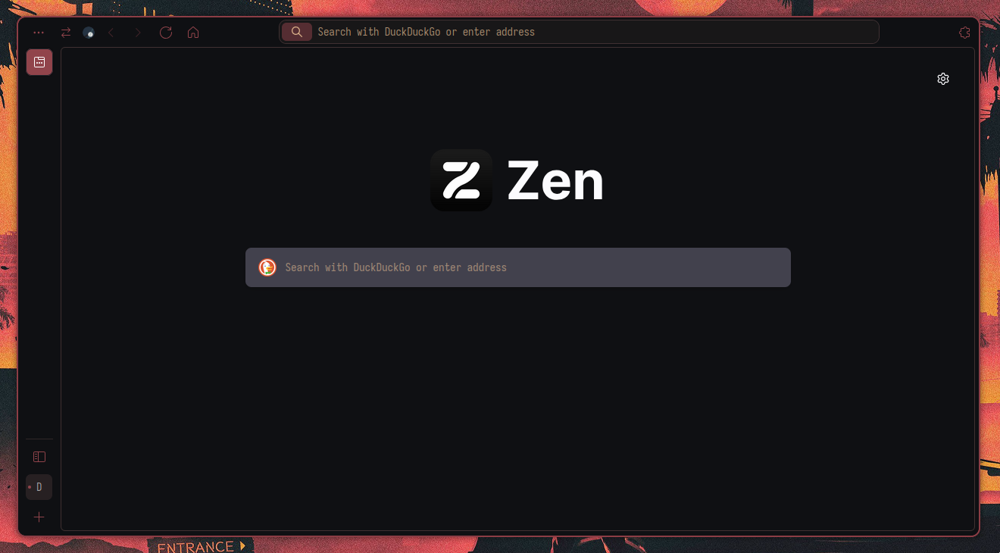
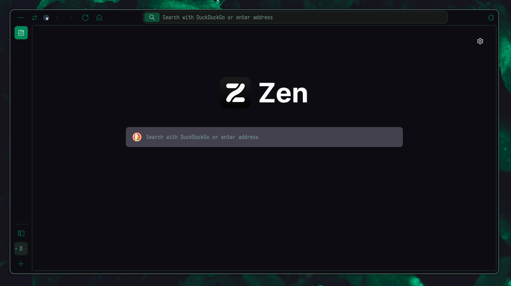
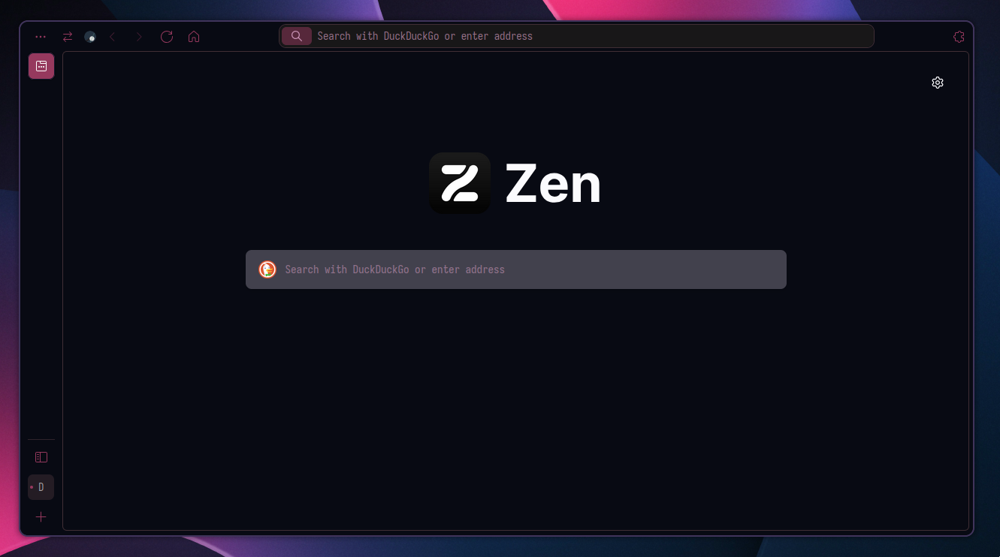

<h1 align="center">🎨 PywalZen</h1>

<i>By using some native color variables, this theme makes <a href="https://github.com/Frewacom/pywalfox">Pywalfox</a> work with <a href="https://zen-browser.app/">Zen Browser</a> correctly.</i>

> [!CAUTION]
> Use this exclusively with Pywalfox, if not the theme will look wrong causing unreadable text and other issues.

## Installation Instructions

Read [this](https://docs.zen-browser.app/guides/live-editing) guide from Zen on how to use live editing.

1. Install the [Pywalfox extension](https://addons.mozilla.org/firefox/addon/pywalfox/)
2. Navigate to `about:support`
3. Look for the Application Basics section
4. Click on Open Profile Folder
5. Create a new folder called `chrome`
6. Download `userChrome.css` and place it in this folder
7. Restart Zen

<samp>
  
    <b>
    <i>Please consider giving me a tip. :)</i>
     
    <a href="https://cafecito.app/axenide">☕ Cafecito</a> |
    <a href="https://ko-fi.com/axenide">❤️ Ko-Fi</a> |
    <a href="https://paypal.me/Axenide">💸 PayPal</a>
  
</samp>

